# im2latex tensorflow implementation

This is a tensorflow implementation of the HarvardNLP paper - What You Get Is What You See: A Visual Markup Decompiler.

This is also a potential solution to OpenAI's Requests For Research Problem - [im2latex](https://openai.com/requests-for-research/#im2latex)

The paper (http://arxiv.org/pdf/1609.04938v1.pdf) provides technical details of the model.

Original Torch implementation of the paper[https://github.com/harvardnlp/im2markup/blob/master/]

    What You Get Is What You See: A Visual Markup Decompiler  
    Yuntian Deng, Anssi Kanervisto, and Alexander M. Rush
    http://arxiv.org/pdf/1609.04938v1.pdf

This is a general-purpose, deep learning-based system to decompile an image into presentational markup. For example, we can infer the LaTeX or HTML source from a rendered image.

<p align="center"></p>

An example input is a rendered LaTeX formula:

<p align="center"></p>

The goal is to infer the LaTeX formula that can render such an image:

```
 d s _ { 1 1 } ^ { 2 } = d x ^ { + } d x ^ { - } + l _ { p } ^ { 9 } \frac { p _ { - } } { r ^ { 7 } } \delta ( x ^ { - } ) d x ^ { - } d x ^ { - } + d x _ { 1 } ^ { 2 } + \; \cdots \; + d x _ { 9 } ^ { 2 }
```

## Sample results from this implementation

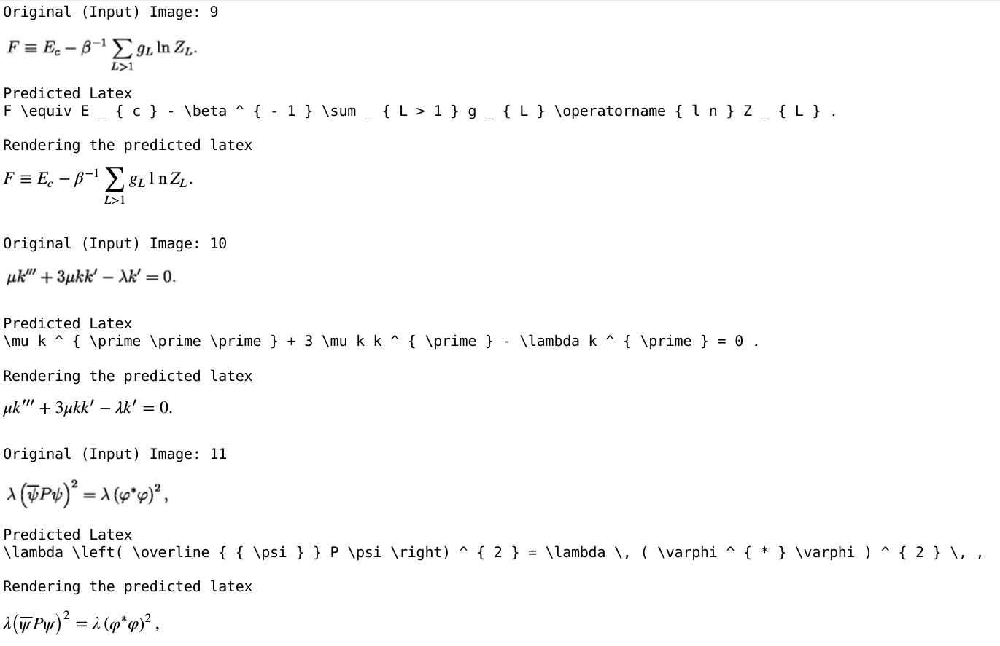

For more results, view [results_validset.html](https://rawgit.com/ritheshkumar95/im2markup-tensorflow/master/results_validset.html), [results_testset.html](https://rawgit.com/ritheshkumar95/im2markup-tensorflow/master/results_testset.html) files.

## Prerequsites

Most of the code is written in tensorflow, with Python for preprocessing.

### Preprocess
The proprocessing for this dataset is exactly reproduced as the original torch implementation by the HarvardNLP group

Python

* Pillow
* numpy

Optional: We use Node.js and KaTeX for preprocessing [Installation](https://nodejs.org/en/)

##### pdflatex [Installaton](https://www.tug.org/texlive/)

Pdflatex is used for rendering LaTex during evaluation.

##### ImageMagick convert [Installation](http://www.imagemagick.org/script/index.php)

Convert is used for rending LaTex during evaluation.

##### Webkit2png [Installation](http://www.paulhammond.org/webkit2png/)

Webkit2png is used for rendering HTML during evaluation.

### Preprocessing Instructions

The images in the dataset contain a LaTeX formula rendered on a full page. To accelerate training, we need to preprocess the images.

Please download the training data from https://zenodo.org/record/56198#.WFojcXV94jA and extract into source (master) folder.

```
cd im2markup
```

```
python scripts/preprocessing/preprocess_images.py --input-dir ../formula_images --output-dir ../images_processed
```

The above command will crop the formula area, and group images of similar sizes to facilitate batching.

Next, the LaTeX formulas need to be tokenized or normalized.

```
python scripts/preprocessing/preprocess_formulas.py --mode normalize --input-file ../im2latex_formulas.lst --output-file formulas.norm.lst
```

The above command will normalize the formulas. Note that this command will produce some error messages since some formulas cannot be parsed by the KaTeX parser.

Then we need to prepare train, validation and test files. We will exclude large images from training and validation set, and we also ignore formulas with too many tokens or formulas with grammar errors.

```
python scripts/preprocessing/preprocess_filter.py --filter --image-dir ../images_processed --label-path formulas.norm.lst --data-path ../im2latex_train.lst --output-path train.lst
```

```
python scripts/preprocessing/preprocess_filter.py --filter --image-dir ../images_processed --label-path formulas.norm.lst --data-path ../im2latex_validate.lst --output-path validate.lst
```

```
python scripts/preprocessing/preprocess_filter.py --no-filter --image-dir ../images_processed --label-path formulas.norm.lst --data-path ../im2latex_test.lst --output-path test.lst
```

Finally, we generate the vocabulary from training set. All tokens occuring less than (including) 1 time will be excluded from the vocabulary.

```
python scripts/preprocessing/generate_latex_vocab.py --data-path train.lst --label-path formulas.norm.lst --output-file latex_vocab.txt
```

Train, Test and Valid images need to be segmented into buckets based on image size (height, width) to facilitate batch processing.

train_buckets.npy, valid_buckets.npy, test_buckets.npy can be generated using the DataProcessing.ipynb script

```
### Run the individual cells from this notebook
ipython notebook DataProcessing.ipynb
```

## Train

```
python attention.py
```
Default hyperparameters used:
* BATCH_SIZE      = 20
* EMB_DIM         = 80
* ENC_DIM         = 256
* DEC_DIM         = ENC_DIM*2
* D               = 512 (#channels in feature grid)
* V               = 502 (vocab size)
* NB_EPOCHS       = 50
* H               = 20  (Maximum height of feature grid)
* W               = 50  (Maximum width of feature grid)

The train NLL drops to 0.08 after 18 epochs of training on 24GB Nvidia M40 GPU.

## Test

predict() function in the attention.py script can be called to predict from validation or test sets.

Predict.ipynb script displays and renders the results saved by the predict() function

## Evaluate

attention.py scores the train set and validation set after each epoch (measures mean train NLL, perplexity)

#### Scores from this implementation

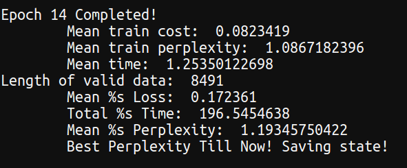
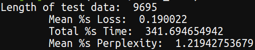

## Weight files
[Google Drive](https://drive.google.com/drive/folders/0BwbIUfIM1M8sc0tEMGk1NGlKZTA?usp=sharing)

## Visualizing the attention mechanism


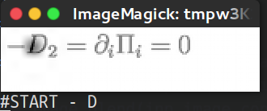

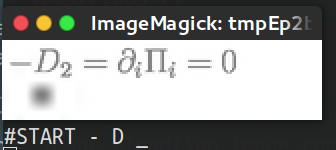

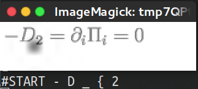

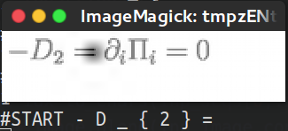

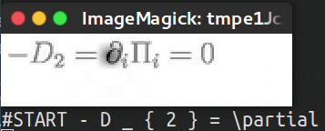

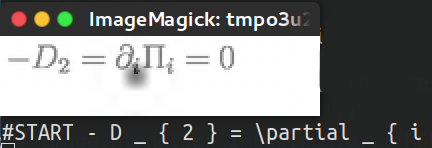

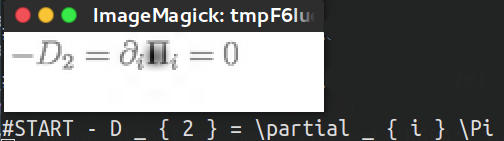

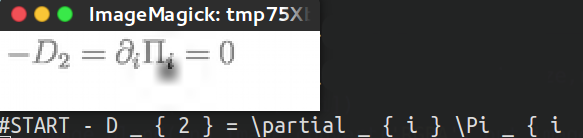

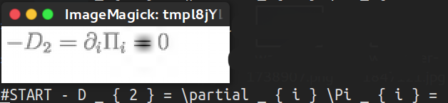

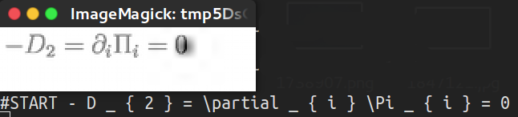
